#  ArcGIS CityEngine for Rhino

ArcGIS CityEngine for Rhino is a plugin for [Rhino3D and Grasshopper](https://www.rhino3d.com). It provides a Rhino command and Grasshopper components which enable the execution of [CityEngine](https://www.esri.com/software/cityengine) ‘rules’ within a Rhino scene. Therefore, a Rhino artist or designer does not have to leave their familiar Rhino environment anymore to make use of CityEngine’s procedural modeling power. Complicated export-import steps are no longer needed, which also means that the procedural models do not need to be “baked” anymore. The building or street models stay procedural during the entire design or planning workflow. Consequently, the user can change any attributes of the building or street models easily by connecting them to other Grasshopper components.

CityEngine for Rhino requires so-called rule packages (RPK) as input, which are authored in CityEngine. An RPK includes assets and a CGA rule file which encodes an architectural style. Comprehensive RPK examples are available below.

_CityEngine for Rhino is free for personal, educational, and non-commercial use._ Commercial use requires at least one commercial license of the latest CityEngine version installed in the organization. Redistribution or web service offerings are not allowed unless expressly permitted.

## Quick Start

Download and open the ["Street Segment" example](https://esri.github.io/cityengine/rhino#examples) or create a scene from scratch:

1. In CityEngine, download e.g. [Tutorial 9](https://doc.arcgis.com/en/cityengine/latest/tutorials/tutorial-9-advanced-shape-grammar.htm) and export the "Parthenon" CGA rules to a RPK (see [Creating a Rule Package](https://doc.arcgis.com/en/cityengine/latest/help/help-rule-package.htm)).
1. Install CityEngine for Rhino from the [market place at food4rhino](https://www.food4rhino.com/en/app/arcgis-cityengine-rhino-and-grasshopper).
1. Start Rhino and open Grasshopper.
1. In Grasshopper go to the "Esri" tab and find the "ArcGIS CityEngine" section, drag the "CityEngine" component into the document.
1. Right-click on the RPK input parameter to select the "Parthenon" RPK created above. CityEngine for Rhino will ask you to save the document, so it can store the path to the RPK relative to the document. It is best practice to put RPKs next to the Grasshopper document or in a subdirectory.
1. Create a "Surface" component and use the "Set one surface" context menu entry to draw a surface in Rhino with the "Surface from 3 or 4 corner points" tool.
1. Connect the "Surface" to the "Shapes" input. Now CityEngine for Rhino will generate the model in the Rhino viewport.

## Table of Contents

- [User Manual](#user-manual)
- [Developer Manual](#developer-manual)
- [Release Notes](#release-notes)
- [Licensing Information](#licensing-information)

## User Manual

CityEngine for Rhino technically consists of two plugins, (1) a command for Rhino and (2) components for Grasshopper. We expect CityEngine for Rhino to be used mainly through Grasshopper as only there its full potential can be used by connecting it to other Grasshopper components. The lower-level Rhino command `ApplyRulePackage` is useful to one-off test CityEngine Rule Packages.

### Installation

#### System Requirements
* Windows 10 or 11 (Intel/AMD 64bit).
* Rhino 7.17 (or later) or Rhino 8.8 (or later).
* To author Rule Packages (RPK), a license for CityEngine is needed.

#### Recommended Installation Method: Food4Rhino Marketplace

Go to the [market place](https://www.food4rhino.com/en/app/arcgis-cityengine-rhino-and-grasshopper) and click on Download, this will download and install CityEngine for Rhino.

#### Install from local files

See [below](#install-locally-built-packages) in the developer documentation.

### Using the CityEngine Grasshopper components

After starting Grasshopper, the CityEngine for Rhino Grasshopper components are located in the `CityEngine` tab.

The main `CityEngine for Grasshopper` component is used for generating models, materials and reports out of a CityEngine Rule Package (RPK) and input shapes (polygons, surfaces, meshes). The "bulk" variant is identically in functionality, just provides an alternative way to specify large numbers of parameters (see [below](#using-the-CityEngine-bulk-grasshopper-component)). The two helper components `CityEngine CGA Reports Unpacker` and `CityEngine CGA Reports Display` assist with inspecting and displaying report values generated by the CGA rules.

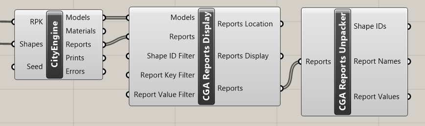

#### Connecting the main CityEngine for Rhino inputs

The `CityEngine for Grasshopper` component has two fixed inputs. The `RPK` input takes a file path from a CityEngine Rule Package file (.rpk). The second input `Shape(s)` takes one or more input geometries (Mesh, Rectangle, Brep, Surface).

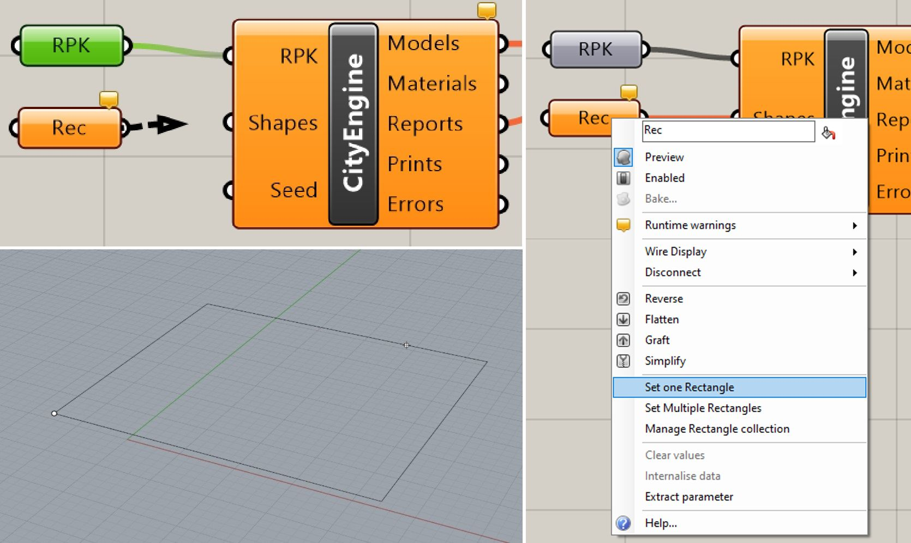

Any Grasshopper component providing such objects can be connected to the `Shape(s)` input, for example the `Rectangle` component. The steps how to define a `Rectangle` input are:

1. Create a `Rectangle` component
1. Right-click on the `Rectangle` component and choose `Set one Rectangle` or `Set Multiple Rectangles`.
1. Draw the rectangle(s) in the Rhino viewport using the Rhino `Rectangle` tool.
1. Select the rectangle.

In case building models are pointing "down": CityEngine for Rhino considers the winding order of input polygons. The Rhino `Flip` command can be used to correct the orientation of the input polygons.

#### Preparing input shapes for CityEngine for Rhino

As the CGA language requires polygon meshes as input, CityEngine for Rhino by default converts all non-mesh input shapes to meshes using the "fast render mesh" settings.

There are multiple ways to control the creation of polygons when converting Breps, Curves, Polylines and Surfaces to Meshes:
1. Directly pass the raw converted mesh into CityEngine for Rhino and use the CGA [`cleanupGeometry`](https://doc.arcgis.com/en/cityengine/latest/cga/cga-clenaup-geometry.htm) operation to remove internal edges in the rules.
1. Use the Rhino commands `AddNgonsToMesh` and `DeleteMeshNgons` to control how polygons are grouped together into Ngons within the mesh.
1. Use the ["Ngon" plugin](https://www.food4rhino.com/en/app/ngon) for detailed control of the conversion.

CityEngine for Rhino will recognize the Ngons created by above methods in the input meshes and use them to create the actual input polygon faces for the model generation. In below example, we first used the raw Rhino triangles and quads to run a simple offset-and-extrude rule. Then we used Rhino's `AddNgonsToMesh` command to combine some of the quads/triangles to Ngons. CityEngine for Rhino will treat triangles/quads not associated to a Ngon as individual input faces.

To illustrate the use of the "Ngon" plugin, we use the "From Mesh" tool to convert a closed Rhino Curve to a single Ngon and then apply the same simple offset-and-extrude rule:

#### Working with rule attribute inputs

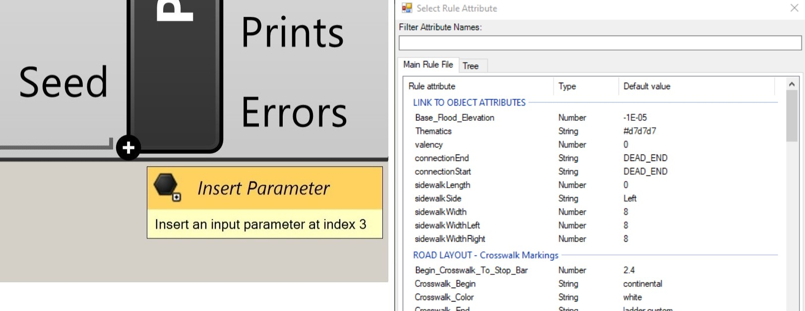

When both main inputs for RPK and Shapes are connected, the component starts to generate geometry. Initially, the default values for the CGA rule attributes are used. It is possible to override them by adding input parameters to the CityEngine for Rhino component. To do that, zoom on the component until a small `+` button appears. Please note, the `+` button will only appear if the CGA rule defines any attributes. The "Select Rule Attributes" dialog window opens in which new inputs can be selected from the list of available rule attributes, defined in the rule package currently used. The dialog has tabs for the main rule file and optionally for imports. Each tab has columns for name, data type and default value.

These parameter inputs can then be connected to other Grasshopper components. The context menu also provides an easy way to directly assign a value. CityEngine for Rhino will use default values for unconnected inputs which are defined in the rules and in general also depend on the input shapes.

Rule attributes and the corresponding CityEngine for Rhino component inputs use four basic data types: (1) Number, (2) String, (3) Boolean (Toggle) and (4) Colour. These can be either single values or lists of values. In case of lists and length mismatches, CityEngine for Rhino will either truncate lists or repeat the last value of a list until the length of the `shape(s)` input is matched.

Please note that string attributes representing assets like `.obj` or texture files can only refer to files within the current Rule Package (RPK). CityEngine for Rhino will interpret the string as a file path (with forward slashes as separator) relative to the RPK root, e.g. `assets/my_asset.obj`. In case of unexpected behavior, it can be useful to inspect the RPK in question with a tool like `7zip` to confirm the presence of asset files.

The inputs are typically created by these built-in Grasshopper components:

- Number(s): `Number` and `Number Slider`
- String(s): `Panel` and `Text`
- Boolean(s): `Bool` and `Toggle`
- Color(s): `Colour`, `Colour Picker` and `Swatch`

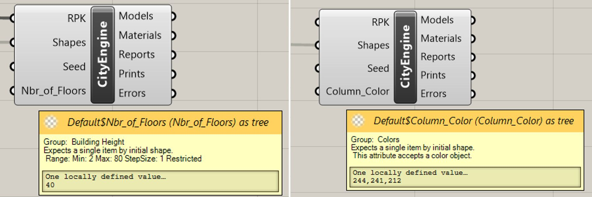

To get more information on each rule attribute input, the user can hover with the mouse over each of them. A tooltip is displayed, containing information on the expected data. CityEngine for Rhino will read the CGA annotations on the rule attributes and display metadata such as the allowed range for numbers.

If the CGA rule attribute is annotated as an enumeration the tooltips will list the range of values.

##### Extract parameter

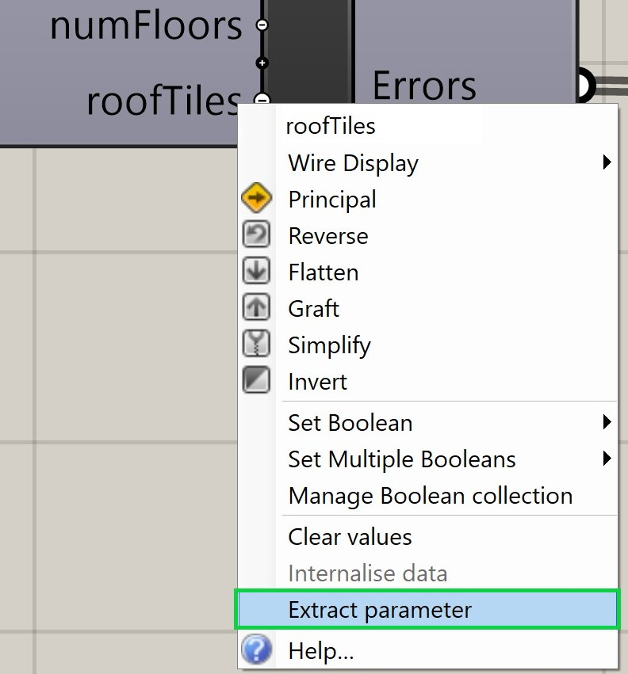

It is possible to automatically create connected input components by using the `Extract Parameter` feature. Right-click on the input parameter you want to extract and select `Extract parameter`. The new component will display the same name and description as the input parameter, and have the attribute's default value(s) assigned to it.

#### Working with the CityEngine for Rhino outputs

The `CityEngine for Rhino` component has five outputs:

1. Models: The generated meshes.
1. Materials: The generated materials
1. Reports: The generated cga reports.
1. Prints: The messages defined in the cga rule.
1. Errors: The errors encountered during the generation process.

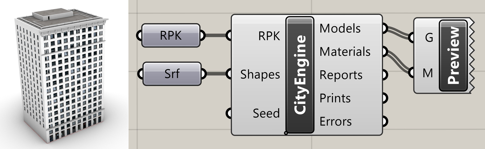

The `Models` output will contain for each input shape a list of meshes (one mesh per material). The generated materials can be applied to the meshes by connecting the built-in `Custom Preview` component. The reports are output as a custom data type which can be displayed and converted with the CityEngine for Rhino reports helper components.

#### Toggle the material generation

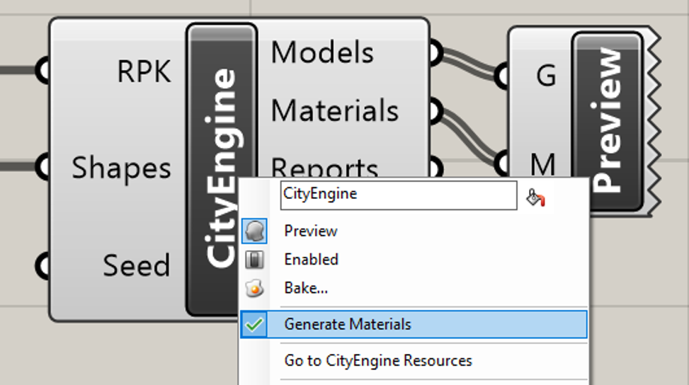

Each Grasshopper component has an option menu that can be opened by right-clicking on the component name. The CityEngine for Rhino menu contains an additional menu item to toggle the material generation. This is useful to speedup model generation when working with complex scenes.

#### Using the CityEngine CGA Reports helper components

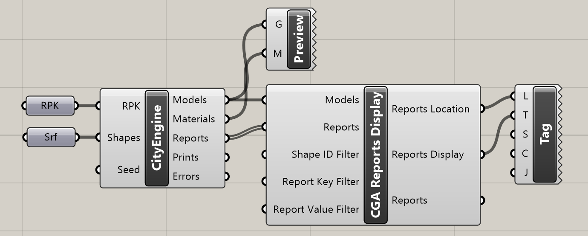

The `CityEngine CGA Reports Display` is designed to help display CGA report values in the Rhino viewport and takes 5 inputs. The first two are typically connected to the respective outputs of the main `CityEngine for Rhino` component. The next three inputs are optional filters:

1. `Shape ID Filter`: Used to filter the reports by initial shape ID. Accepts a Domain component.
1. `Report Key Filter`: Filters the reports by key name. Accepts a `Panel` or `Text` component, or a list of them. Report keys can be written on multiple lines.
1. `Report Value Filter`: This input allows to select specific values for each keys selected in the `Report Key Filter` input.

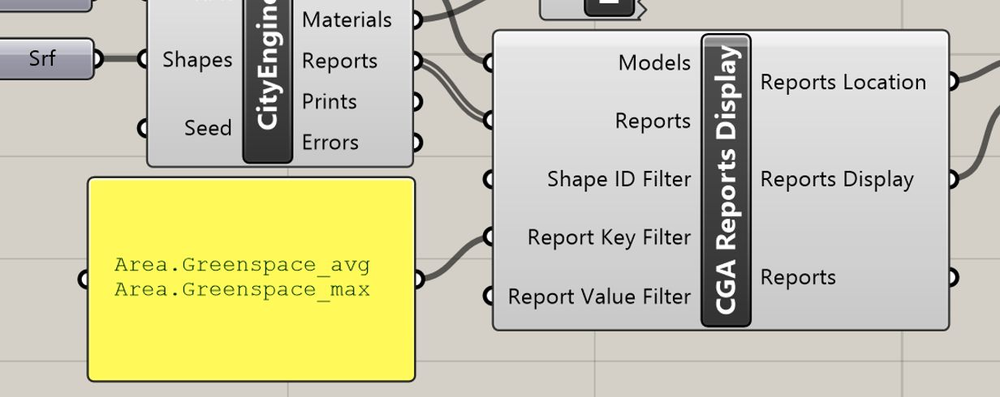

This component has three outputs, the first two can be connected to a `Text Tag 3D` component to display the selected reports in the Rhino viewport. The `Reports Location` output provides the location to position and align the reports text above each generated model. The `Reports Display` output provides the formatted reports text.

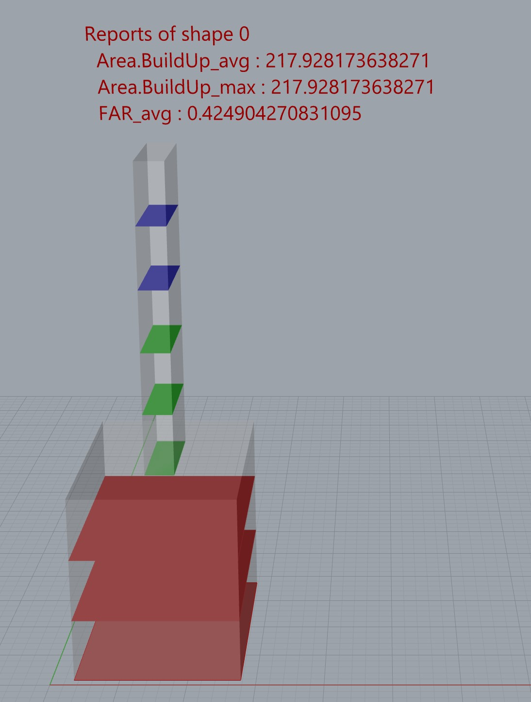

Here is an example of reports displayed in the `Rhino` viewport using the `Text Tag 3D` component.

The `Reports` passes through the selected reports for further processing. For example, to unpack them with the `CityEngine CGA Reports Unpacker`.

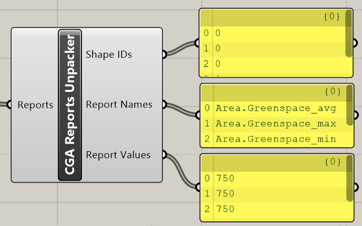

The `CityEngine CGA Reports Unpacker` component unpacks the reports data from `CityEngine for Rhino` into lists of shape index, report name and report value. This is typically used to further process the reports with built-in Grasshopper components, e.g. to write the reports to a text file.

### Using the CityEngine Bulk Grasshopper component

The `CityEngine Bulk` component works like the standard `CityEngine` component with the difference that all CGA attributes are input with a single (tree) parameter. The below example uses a Panel with _"Multiline Data" disabled_ and each line represents a CGA attribute in the form `<name>:<value>`.

A typical use case is to read the CGA attributes from a text file using the `File` component (set to "per line"). Note that empty lines are silently ignored.

### Using the CityEngine for Rhino command (ApplyRulePackage)

In Rhino, select a shape and type the command `ApplyRulePackage` in the command line. This will open a file dialog to choose a RPK file. After confirming, the models will be generated on the selected shape.

Please note, this command is only meant to provide a quick way for testing a RPK on a shape. It is currently not possible to change the rule attributes, nor will the command apply materials.

## Developer Manual

### Software Requirements

- Windows 10 or 11 (Intel/AMD 64bit)
- Rhino 7 or 8 including Rhino SDK (<https://www.rhino3d.com/download>)
- Microsoft Visual Studio 2022 or later with MSVC 14.37, MFC for MSVC 14.37 and C# (.NET Framework 4.8 and .NET Core 7.0)
- Optional: Python 3.9 or later

### Build Instructions

1. Install the tools from the [Software Requirements](#software-requirements) section.
1. Follow the instructions from the [Rhino documentation](https://developer.rhino3d.com/guides/cpp/installing-tools-windows/) to install the Rhino SDK and related tools.
1. Follow the instructions from the [Rhino documentation](https://developer.rhino3d.com/guides/grasshopper/installing-tools-windows/) to install the Grasshopper SDK.
1. Checkout this Git repository.
1. Open the Visual Studio solution.
1. Ensure the configuration is set to `Release` and `x64` (the only supported configuration).
1. Build the solution. The result is stored in the `build` directory, foremost `CityEngineRhino.rhp` and `CityEngineGrasshopper.gha`.

### Installing locally built plugins

After having built the plugins, they have to be installed in Rhino and Grasshopper respectively.

1. Start Rhino. In the menu bar, go to _Tools -> Options -> Rhino Options -> Plug-ins_.
1. Click on `install` and select the `CityEngineRhino.rhp` file located in `path-to-solution/build`.
1. To install the Grasshopper plugin, run the command `GrasshopperDeveloperSettings` in Rhino.
1. In the window that opens, add the folder `path-to-solution/build` containing `CityEngineGrasshopper.gha`. Make sure the `Memory load .gha assemblies...` box is unticked.
1. Confirm, then restart Rhino and Grasshopper.

### Create installation packages (rhi, yak)

Once both plugins (`rhp` for Rhino, `gha` for Grasshopper) are built, it is possible to create a `rhi` (Rhino Installer) package and/or a `yak` package using the `create_package.py` python script. A `rhi` package is simply a zip archive containing all files required to run a plugin. If Rhino is installed, the plugin can be installed by double-clicking the package. It will extract the files and Rhino/Grasshopper will load them when started. The `yak` package is the archive that can be uploaded to the Rhino marketplace in order to publish the plug-in.

1. Open a console, navigate to the CityEngine for Rhino solution directory and run the command `python create_package.py <option>`. Valid values for `<option>` are `both` (default), `rhi`, or `yak` to choose which package type to build.
1. The resulting `rhi` and `yak` packages will be created in a folder named `packages` located in the solution root directory.

### Install locally built packages

1. Close Rhino if it is open.
1. Run the `rhi` package by double-clicking it.
1. The package installer will open. Follow the instructions.
1. The plugin will be loaded at the next start of Rhino/Grasshopper.

Note: In case of troubles, try to enable the "Ask to load disabled plug-ins" box located in Rhino's _Tools -> Options -> Plug-ins_.

### Debug the native code

For debugging, keep the `Release` configuration (we always generate PDBs) and turn off the C++ optimizations in the `RinoCodecs` and `CityEngineRhino` C++ project properties. Rebuild and attach the debugger to Rhino and set breakpoints.

## Release Notes

### Version 1.4.0 (2025-10-10)

- Added support for Rule Packages created with CityEngine 2025.0

### Version 1.3.0 (2025-03-05)
* Added support for Rule Packages created with CityEngine 2024.1

### Version 1.2.0 (2024-10-28)
* Rebranded from "Puma" to "ArcGIS CityEngine for Rhino and Grasshopper". We will continue to use the compact name "Puma" in the source code.
* Small restructuring of the Grasshopper component toolbar to make it easier to find for new users.
* Renamed the build output to `CityEngineRhino.rhp`, `CityEngineGrasshopper.gha` as well as `CityEngineRhino.rhi/yak`.

### Version 1.2.0 Beta 2 (2024-09-05)
* Improved the new bulk component: added new icon, silently ignore empty input lines for attribute values, warn if lines do not match the key:value pattern.
* Added support for Rhino 8, removed support for Rhino 6.
* Added support for Rule Packages created with CityEngine 2024.0.

### Version 1.2.0 Beta 1 (2024-07-29)
* Added a new component where CGA attributes can be input in bulk via a tree parameter.
* Supports Rule Packages from CityEngine 2023.1 and older. Note, the final version 1.2.0 will support CityEngine 2024.0.
* Supports Rhino 6 and 7. Note, Rhino 6 support will be removed in the final version 1.2.0.

### Version 1.1.0 (2023-07-27)
* Supports Rule Packages from CityEngine 2023.0 and older.
* Improved the user experience when overriding CGA Rule Attributes.
* Added support for user-created Mesh Ngons in input shapes.

### Version 1.0.0 (2021-12-10)
* Corresponds to v0.9.4 with updated documentation.
* Published ["Street Segment" example](https://esri.github.io/cityengine/rhino#examples) (for Rhino 7) to show-case the main features of Puma.
* Supports Rhino 6 and 7.
* Supports Rule Packages from CityEngine 2021.1 and older.
* Limitation: no support yet for PBR materials in Rhino 7.

### Version 0.9.4 (2021-11-15)
* Public Beta.
* Updated to PRT 2.5: Supports Rule Packages (RPK) from CityEngine 2021.1 and older.
* Fixed use of wrong rule attribute values in a GH document with multiple CityEngine for Rhino nodes.
* Fixed group assignment of extracted parameters.
* Supports Rhino 6 and 7.

### Version 0.9.3 (2021-09-22)
* Internal test build.
* Supports Rhino 6 and 7.
* Supports Rule Packages from CityEngine 2021.0 and older.
* Improved portability of Grasshopper documents by storing relative paths to Rule Packages (introduces a "RPK" custom parameter).
* Detect external modification of Rule Packages and potentially reload them when solving the Grasshopper document.
* Correctly keep manually set parameter values when internalizing a parameter.
* Fixed parameter extraction of rule attributes after loading a Grasshopper document.
* Fixed handling of polygons with holes.
* Various code cleanups.

### Version 0.9.2 (2021-08-09)
* Internal test build.
* Supports Rhino 6 and 7.
* Supports Rule Packages from CityEngine 2021.0 and older.
* Improved conversion of non-Mesh input shapes. Rhino Rectangles now have a consistent winding order.
* Optimized loading performance of large Rule Packages with many textures.
* Improved "extract parameter" behavior for rule attributes. This includes support for array attributes and using dedicated components (e.g. toggles and sliders) for single value attributes.

### Version 0.9.1 (2021-07-16)
* Internal test build.
* Supports Rhino 6 and 7.
* Supports Rule Packages from CityEngine 2021.0 and older.
* Optimized model generation to distribute input shapes across all CPU cores.
* Improved attribute sorting in chooser dialog to match the CityEngine inspector as close as possible.

### Version 0.9.0 (2021-07-02)
* Internal test build.
* Supports Rhino 6 and 7.
* Supports Rule Packages from CityEngine 2021.0 and older.
* Supports multiple input shapes with different rule attribute values.
* Switched to dynamic input parameters for the rule attributes on the CityEngine for Rhino components. Do not show all possible rule attributes by default to keep the CityEngine for Rhino component compact.
* Added support for rule array attributes.
* Added input parameter to control random generator per CityEngine for Rhino component.
* Added output parameters for CGA print and asset error/warning outputs.
* Added support for creating `yak` packages.
* Added initial manual.

### Version 0.6.0 (2020-12-01)
* Internal test build.
* Supports Rhino 6.
* Supports Rule Packages from CityEngine 2020.0 and older.
* Supports multiple input shapes with same rule attributes.
* Added Grasshopper helper components to process and display CGA report values.
* Development: Added support for creating `rhi` packages.

### Version 0.5.0 (Fall 2020)
* First internal proof of concept.

## Contributing

Esri welcomes contributions from anyone and everyone. Please see our [guidelines for contributing](https://github.com/esri/contributing).

## Licensing Information

CityEngine for Rhino is free for personal, educational, and non-commercial use. Commercial use requires at least one commercial license of the latest CityEngine version installed in the organization. Redistribution or web service offerings are not allowed unless expressly permitted.

CityEngine for Rhino is under the same license as the included [CityEngine SDK](https://github.com/Esri/esri-cityengine-sdk#licensing). An exception is the CityEngine for Rhino source code (without CityEngine SDK, binaries, or object code), which is licensed under the Apache License, Version 2.0 (the “License”); you may not use this work except in compliance with the License. You may obtain a copy of the License at <https://www.apache.org/licenses/LICENSE-2.0>.

For questions or enquiries, please contact the Esri CityEngine team (cityengine-info@esri.com).
